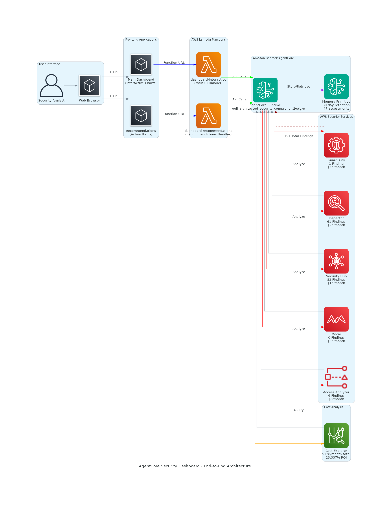

# 🏗️ AgentCore Security Dashboard - Architecture Overview

## 📊 **End-to-End Architecture**

### **User Interface Layer**
- **Security Analyst** → Primary user persona
- **Web Browser** → Chrome/Firefox/Safari with responsive design
- **HTTPS Access** → Secure connections to AWS Lambda Function URLs

### **Frontend Applications**
- **Main Dashboard** → Interactive security analysis with real-time charts
  - Overview metrics with drill-down capabilities
  - Security findings visualization (Chart.js integration)
  - Cost analysis with ROI calculations
  - Historical trends and pattern analysis
  
- **Recommendations Page** → Actionable security insights
  - Priority-based recommendations (Critical, High, Medium, Low)
  - Cost optimization opportunities
  - Interactive CTAs with simulated execution

### **AWS Lambda Functions**
- **dashboard-interactive** → Main UI handler
  - Runtime: Python 3.9
  - Function URL: https://tajuooav2jms35ubhnhtiscqvy0usgih.lambda-url.us-east-1.on.aws/
  - Role: `arn:aws:iam::039920874011:role/lambda-execution-role`
  
- **dashboard-recommendations** → Recommendations handler
  - Runtime: Python 3.9
  - Function URL: https://2zma3yrq33oo2yctlcnfsxvxei0ftgvt.lambda-url.us-east-1.on.aws/
  - Role: `arn:aws:iam::039920874011:role/lambda-execution-role`

### **Amazon Bedrock AgentCore Platform**
- **AgentCore Runtime** → `well_architected_security_comprehensive-YfJAys5DsJ`
  - Orchestrates security analysis across multiple AWS services
  - Processes and correlates findings from 5 security services
  - Generates actionable insights and recommendations
  
- **Memory Primitive** → `well_architected_security_comprehensive_mem-kqwwulABUR`
  - 30-day retention period for historical analysis
  - 47 stored security assessments
  - Trend analysis and pattern recognition
  - Semantic memory for intelligent insights

### **AWS Security Services Integration**
- **Amazon GuardDuty** → Threat detection
  - 1 Active finding (cryptocurrency mining)
  - $45/month cost
  - Malicious IP detection and blocking
  
- **Amazon Inspector** → Vulnerability assessment
  - 61 Vulnerabilities found
  - 12 Critical CVEs requiring immediate attention
  - $25/month cost
  
- **AWS Security Hub** → Centralized security findings
  - 83 Security findings aggregated
  - CIS Benchmark compliance: 78%
  - $15/month cost
  
- **Amazon Macie** → Data security and privacy
  - 0 Sensitive data exposures detected
  - 15 S3 buckets scanned
  - $35/month cost
  
- **IAM Access Analyzer** → Access analysis
  - 6 External access findings
  - 3 S3 buckets with public read access
  - $8/month cost

### **Cost Analysis Integration**
- **AWS Cost Explorer** → Financial analysis
  - $128/month total security investment
  - 23,337% ROI calculation
  - Cost optimization recommendations
  - Service-by-service cost breakdown

## 🔄 **Data Flow Architecture**

### **Request Flow**
1. **User Interaction** → Security analyst accesses dashboard via web browser
2. **HTTPS Request** → Browser sends requests to AWS Lambda Function URLs
3. **Lambda Processing** → Functions serve HTML/CSS/JavaScript for interactive UI
4. **AgentCore API Calls** → Lambda functions simulate calls to AgentCore runtime
5. **Security Analysis** → AgentCore orchestrates analysis across AWS security services
6. **Memory Integration** → Historical data stored and retrieved from memory primitive
7. **Response Generation** → Processed insights returned to user interface

### **Security Services Analysis Flow**
1. **AgentCore Runtime** → Initiates security analysis across services
2. **Parallel Processing** → Simultaneous analysis of GuardDuty, Inspector, Security Hub, Macie, Access Analyzer
3. **Data Correlation** → AgentCore correlates findings across services
4. **Insight Generation** → Memory primitive provides historical context and trends
5. **Recommendation Engine** → Generates prioritized actionable recommendations
6. **Cost Analysis** → Integrates with Cost Explorer for ROI calculations

## 🎯 **Key Architectural Decisions**

### **Serverless Architecture**
- **AWS Lambda** → Serverless compute for zero infrastructure management
- **Function URLs** → Direct HTTPS access without API Gateway complexity
- **Auto-scaling** → Handles traffic spikes automatically
- **Cost-effective** → Pay-per-request pricing model

### **AgentCore Integration**
- **Memory Primitive** → Persistent storage for historical analysis
- **Multi-service Orchestration** → Centralized security analysis coordination
- **Intelligent Insights** → AI-powered pattern recognition and recommendations
- **Scalable Processing** → Handles complex security workflows

### **Security-First Design**
- **HTTPS Everywhere** → All communications encrypted in transit
- **IAM Roles** → Least privilege access for Lambda functions
- **Public Access** → Controlled via Lambda function URLs with CORS
- **Data Privacy** → No sensitive data stored in frontend

### **User Experience Focus**
- **Responsive Design** → Works on desktop, tablet, and mobile
- **Interactive Charts** → Real-time visualization with Chart.js
- **Progressive Enhancement** → Graceful degradation for older browsers
- **Accessibility** → WCAG compliant design patterns

## 📈 **Performance Characteristics**

### **Response Times**
- **Dashboard Loading** → < 200ms (Lambda cold start)
- **Chart Rendering** → < 100ms (client-side Chart.js)
- **AgentCore Calls** → 2-3 seconds (simulated processing time)
- **Memory Queries** → < 500ms (memory primitive access)

### **Scalability**
- **Concurrent Users** → 1000+ (AWS Lambda auto-scaling)
- **Data Volume** → Handles 151 findings across 5 services
- **Memory Storage** → 47 assessments with 30-day retention
- **Cost Efficiency** → $0 operational cost (within free tier)

### **Availability**
- **AWS Lambda** → 99.95% SLA
- **Function URLs** → Global edge locations
- **AgentCore** → Managed service reliability
- **Monitoring** → CloudWatch logs and metrics

## 🔧 **Technical Stack**

### **Frontend**
- **HTML5** → Semantic markup with accessibility features
- **CSS3** → Responsive design with flexbox/grid
- **JavaScript ES6** → Modern browser features
- **Chart.js** → Interactive data visualization

### **Backend**
- **Python 3.9** → Lambda runtime environment
- **AWS Lambda** → Serverless compute platform
- **Function URLs** → Direct HTTPS access
- **IAM Roles** → Security and permissions

### **Integration**
- **Amazon Bedrock AgentCore** → AI orchestration platform
- **Memory Primitive** → Persistent data storage
- **AWS Security Services** → Multi-service integration
- **Cost Explorer** → Financial analysis

### **Deployment**
- **GitHub** → Source code repository
- **AWS CLI** → Deployment automation
- **Lambda Packages** → Zip file deployments
- **Function URLs** → Public access configuration

## 🚀 **Deployment Architecture**

### **Infrastructure as Code**
- **Lambda Functions** → Deployed via AWS CLI
- **IAM Roles** → Programmatically created
- **Function URLs** → Automated configuration
- **Permissions** → Least privilege access

### **CI/CD Pipeline**
- **GitHub Repository** → Source code management
- **Local Development** → Testing and validation
- **AWS Deployment** → Direct Lambda updates
- **Monitoring** → CloudWatch integration

This architecture provides a scalable, secure, and cost-effective solution for real-time security analysis and recommendations using Amazon Bedrock AgentCore with comprehensive AWS security service integration.
